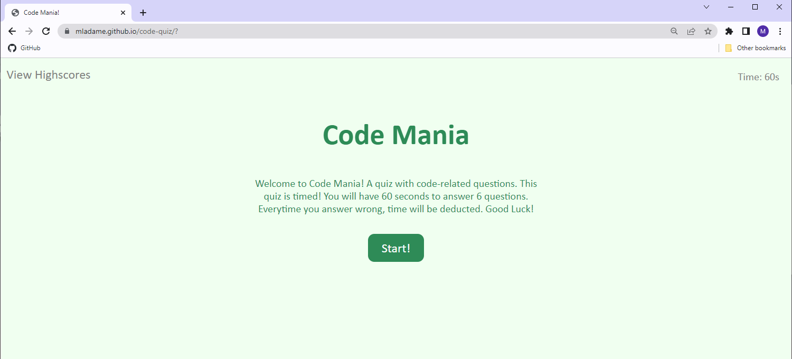

# Code Mania!

  

## Table of Contents

  - [Description](#description)
  - [Licenses](#licenses)
  - [Questions](#questions)
  - [Links](#links)
  - [Demo](#demo)

  ---

## Description

A quick and fun coding trivia quiz for everyone to enjoy! Follow the link below to play the game and see how high you can score!

## Licenses

This project is covered by the MIT license. Click on license badge for more information.

## Questions

Email: mladame43@gmail.com

[Visit my Github Profile](https://github.com/mladame)

## Links

[Code Mania Game](https://mladame.github.io/code-quiz/)

[Code Mania Github Repository](https://github.com/mladame/code-quiz)

## Demo

